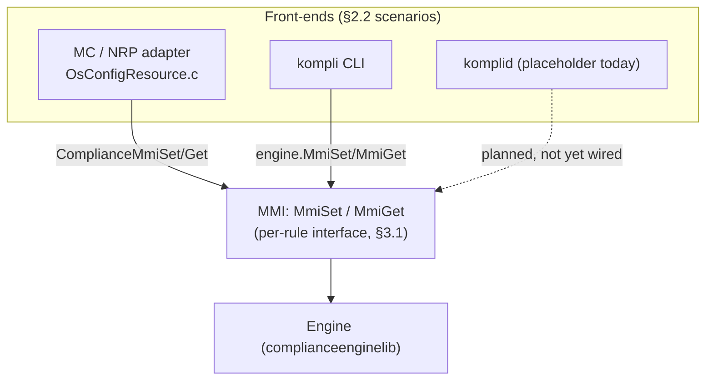
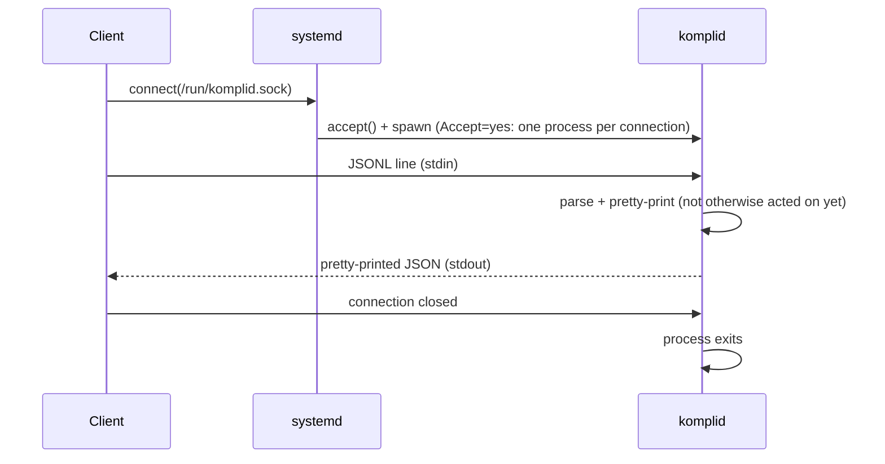
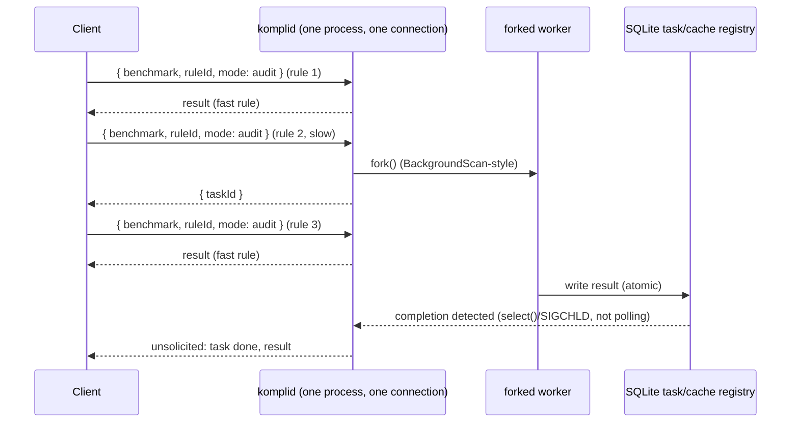
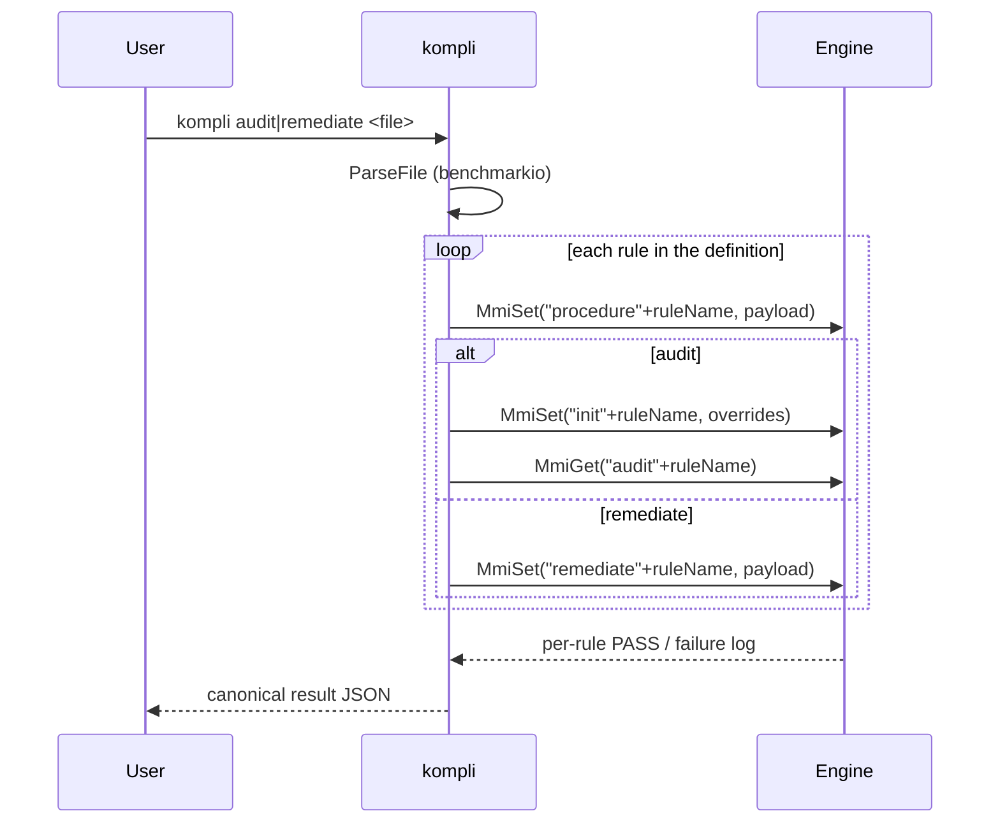
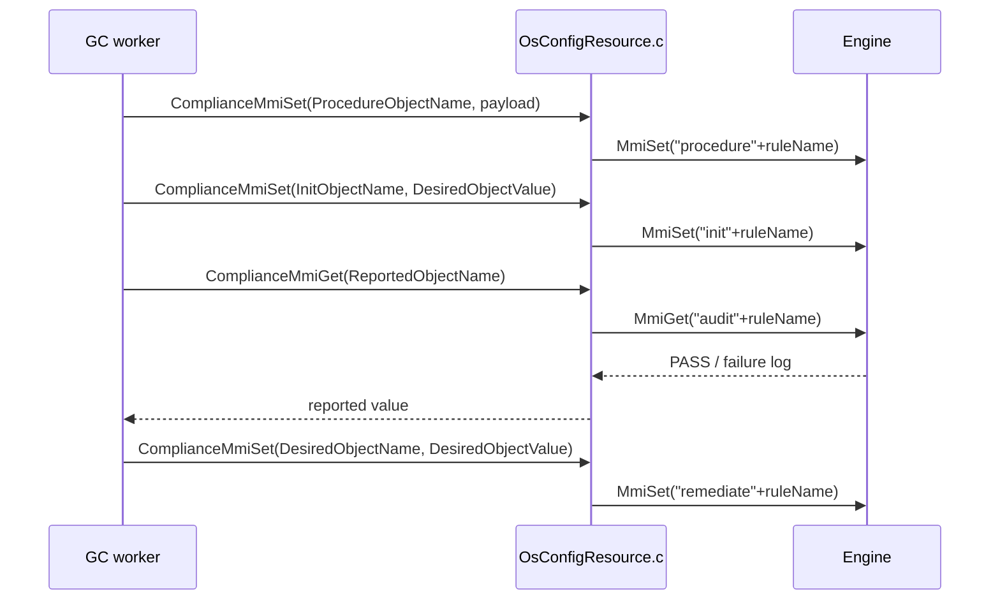

Kompli - North Star Architecture
========================================

# 1. Introduction

Kompli is a modular security configuration stack for Linux. Kompli supports management over Azure and Azure Portal and local CLI.

This document describes the North Star architecture of this project. Its prime target is to guide the people who develop kompli. The doc can be also useful to anyone who is interested to learn about this project.

Kompli design principles are the following:

- Policy evaluator engine.
- Modular architecture.
- Portable and extensible to other management platforms.
- Simple and focused on what is truly needed.
- Not permanently tied to any management authority.

The main way to extend kompli is by developing new [procedures](../src/modules/complianceengine/src/lib/procedures/).

# 2. Overall kompli Architecture

## 2.1. Repository Layout

```
src/
  adapters/
    mc/
      complianceengine/   NRP adapter (Baseline.c, OsConfigResource.c, generated MOF)
  common/
    commonutils/        Shared OS utility functions
    logging/            Circular file logging
    mpiclient/          MPI REST API client
    parson/             Vendored JSON parser
    telemetry/          Telemetry support
  komplid/              Reserved space for the kompli daemon (not yet implemented)
  modules/
    complianceengine/   ComplianceEngine module and tests
      src/lib/          Core engine, evaluator, procedures, Lua integration
      src/so/           Module shared-object entry point
      src/benchmarkio/  Benchmark-definition parsing + input-file security (shared by kompli and komplid)
      src/cli/          kompli CLI tool
      src/lua-evaluator/ Lua evaluator tool
      tests/            Unit tests
    inc/                Module interface headers (Mmi.h)
    mim/                ComplianceEngine MIM definition
    schema/             MIM validation schema
  tests/
    fuzzer/             ComplianceEngine libFuzzer target
```

## 2.2. Scenarios

Kompli supports two integration scenarios that share the same ComplianceEngine module:

- **Machine Configuration (NRP)** — a standalone shared library loaded by the GC worker on demand. The augmentation engine generates MOF files that drive audit and remediation per rule.
- **CLI (`kompli`)** — a standalone CLI tool (`src/modules/complianceengine/src/cli/`) that reads a benchmark-definition JSON file (supplied on disk as a required positional filename argument; stdin is not supported for definitions) and directly executes audits or remediations without any platform or daemon involvement.

A third scenario, **`komplid`** (a native, systemd-managed daemon sharing the same ComplianceEngine core), is planned; see §3 and [src/komplid/README.md](../src/komplid/README.md) for its current (reserved, not-yet-implemented) status.

All three scenarios ultimately drive the same `Engine` through the same
per-rule MMI calls (`MmiSet`/`MmiGet`, §3.1) — they differ only in what sits in
front of it (a GC-driven MOF file, a benchmark-definition file, or — once
implemented — a JSONL request):



# 3. kompli Agent

Kompli will be able to run as a standalone daemon that can evaluate policy given requests from external sources.

> The concrete name for this daemon is **`komplid`**. Its build-graph location
> is [src/komplid/](../src/komplid/README.md), currently a placeholder
> implementation only (validates socket-activation wiring; does not yet act on
> its input). It is started by systemd via socket activation with
> **`Accept=yes`** (one fresh process per connection, chosen for initial
> simplicity) and will share the ComplianceEngine core and the `benchmarkio`
> benchmark-definition/input-security library with the `kompli` CLI rather
> than duplicating that logic. Wire protocol: JSONL over the Unix domain
> socket, replacing the old MPI-over-UDS/HTTP design, one connection per
> session carrying many sequential per-rule requests (see
> [src/komplid/README.md](../src/komplid/README.md#wire-protocol)
> — exact message field names are still open). Slow rules can respond with a
> task ID instead of blocking, backed by a SQLite task registry/audit-result
> cache (see [src/komplid/README.md](../src/komplid/README.md#long-running-rules-background-tasks)).
> Neither `komplid` nor the `kompli` CLI
> use a shared persistent state directory yet (each `kompli`/`komplid`
> invocation gets its own ephemeral temp directory) — intentionally deferred
> until `/etc/kompli/` and a `/var/lib/` state path are finalized, chosen to
> avoid clashing with GuestConfiguration's own state paths on the same system.



The JSONL request schema's exact field names are still under discussion, but
the shape of the exchange is decided (see
[src/komplid/README.md](../src/komplid/README.md#wire-protocol) for the
up-to-date status): one request per rule, many sequential requests per
connection, and a slow rule can defer to a background task instead of
blocking:



**Note on MMI's status**: MMI (§3.1 below) is *not* being removed. It remains
the real, current, per-rule interface underneath every scenario in §2.2 —
`kompli`'s `Engine` class calls it directly (`Engine::MmiSet`/`Engine::MmiGet`,
§4.2), and the NRP/MC adapter's `ComplianceMmiSet`/`ComplianceMmiGet` wrap it
(§5.1). It is "legacy" only in the sense that it's inherited from OSConfig
rather than designed for `komplid`'s JSONL protocol — there is no current plan
to replace it. What *is* being dropped is the old OSConfig platform daemon and
its MPI/HTTP-over-UDS transport (formerly documented here as "kompli
Management Platform"): that daemon has been removed from this fork, and
`komplid`'s JSONL protocol is its replacement, not a peer to it.

MPI's code footprint is not fully gone yet, though: [OsConfigResource.c](../src/adapters/mc/OsConfigResource.c)
still calls into `mpiclient` (`CallMpiOpen`/`CallMpiSet`/`CallMpiGet`) for
non-Compliance (ASB-style) components — dead code in practice, since no
platform daemon exists to answer those calls and kompli's own Compliance
component uses direct MMI (§5.1) instead. It is left untouched for now
(no functional reason to touch it today) and is a candidate for a future
follow-up cleanup pass, tracked here rather than acted on.

## 3.1. MMI

The kompli library implements MMI resource [OsConfigResource.c](../src/adapters/mc/OsConfigResource.c) using [Baseline.c](../src/adapters/mc/complianceengine/Baseline.c), which is used as entry point for MMI module in this case only [ComplianceEngineModule.c](../src/modules/complianceengine/src/so/ComplianceEngineModule.c)

The MMI transports the json object payloads of settings for the module.

In general, any process can load a module and communicate to it over the MMI.

The MMI is a simple C API and includes the calls described in this section.

The MMI header file is [src/modules/inc/Mmi.h](../src/modules/inc/Mmi.h)

## 3.2. MmiGetInfo

MmiGetInfo returns information about the module to help the client to correctly identify it. MmiGetInfo may be called at any time and is typically called immediately after the module is loaded by the client, before MmiOpen. MmiGetInfo must succeed called at any time while the module is loaded.

MmiGetInfo takes as input argument the name of the client (the module use that name to identify the caller, same as passed to MmiOpen) and returns via output arguments a JSON payload and size of payload in bytes plus MMI_OK if success, NULL and respectively 0 as payloadSizeBytes plus an error code if failure, same as MmiGet. The caller must free the memory for payload calling MmiFree.

```C
// Not null terminated, UTF-8, JSON formatted string
typedef char MMI_JSON_STRING;

int MmiGetInfo(
    const char clientName,
    MMI_JSON_STRING payload,
    int payloadSizeBytes);
```

The following values can be present in the JSON payload response. The values not marked (optional) are mandatory. Optional values that are implemented are required to follow the following guideline:

Field | Type | Description
-----|-----|-----
Name | String | Name of the module
Description | String | Short description of the module
Manufacturer | String | Name of the module manufacturer
VersionMajor | Integer | Major (first) version number of the module
VersionMinor | Integer |  Minor (second) version number of the module
VersionPatch | Integer | (optional) Patch (third) version number of the module
VersionTweak | Integer | (optional) Tweak (fourth) version number of the module
VersionInfo | String | Short description of the version of the module
Components | List of strings | The names of the components supported by the module, same as used for the componentName argument for MmiGet and MmiSet. Modules are required to support at least one component.
Lifetime | Enumeration of integers | One of the following values: 0 (Undefined), 1 (Long life/keep loaded): the module requires to be kept loaded by the client for as long as possible (for example when the module needs to monitor another component or Hardware), 2 (Short life): the module can be loaded and unloaded often, for example unloaded after a period of inactivity and re-loaded when a new request arrives
LicenseUri | String | (optional) URI path for license of the module
ProjectUri | String | (optional) URI path for the module project
UserAccount | Integer | (optional) The Linux UID of the user account the module needs to run as. One of the UIDs in the local /etc/passwd. 0 is root. Note that UIDs can change (be moved). Root (0) is default.

In addition to the values in the above table the module manufacturer can add their own values.

A JSON schema of the MmiGetInfo payload response is at [MmiGetInfo JSON schema](../src/modules/schema/mmi-get-info.schema.json)

## 3.3. MmiOpen

MmiOpen starts a new client session with the module. MmiOpen receives as an input argument the name of the client (the module use that name to identify the caller) and the maximum size in bytes for object payload values supported by the client (0 if unlimited). On success, MmiOpen returns a newly created handle to identify this session. The handle is a module-specific opaque handle (where the module can hide a C structure or C++ class that identifies the current session) to be used for subsequent calls. On failure, MmiOpen returns NULL.

```C
typedef void* MMI_HANDLE;

MMI_HANDLE MmiOpen(
    const char* clientName,
    const unsigned int maxPayloadSizeBytes);
```

## 3.4. MmiClose

MmiClose ends a client session with the module. MmiClose receives as an input argument the handle returned by a previous MmiOpen call. No further calls with that handle can be made after this call.

```C
void MmiClose(MMI_HANDLE clientSession);
```

## 3.5. MmiSet

MmiSet function is called with the value of of ProcedureObjectName as the objectName parameter and the value of ProcedureObjectValue as the payload parameter.

This call sets up dynamic procedures for audit and, optionally, remediation. It also determines the list of parameters applicable to the procedure with their default values.
ProcedureObjectName as the objectName parameter and the value of ProcedureObjectValue as the payload parameter.


```C
int MmiSet(
    MMI_HANDLE clientSession,
    const char* componentName,
    const char* objectName,
    const MMI_JSON_STRING payload,
    const int payloadSizeBytes);
```

On completion MmiSet returns MMI_OK (0) if success or an error code defined in errno.h.

```C
// Plus any error codes from errno.h
#define MMI_OK 0
```

The payload argument contains a JSON formatted, not null terminated UTF-8 string, that contains one or multiple values in the following format:

- Integer payload example: ```"123"```
- String payload example: ```"This is a test"```
- Boolean payload example: ```"true"```
- Complex payload example combining all the above as fields into same object payload: ```"{"valueOne":123,"valueTwo":"This is a test.","valueThree":true}"``` where "valueOne", "valueTwo" and "valueThree" are the respective field names.

Kompli will not attempt to parse and validate the payload and payloadSizeBytes arguments. It is the responsability of the respective Module to do this and return errors if appropriate. Modules must also validate the clientSession, componentName and objectName arguments against invalid values.

The maximum size of payload will be limited to the size specified via MmiOpen if that's a non-zero value (0 meaning unlimited).

MmiSet may be called with the same payload several times. Kompli must be able to handle these calls either by reapplying the desired payload or detect when the respective desired configuration was already applied and in that case return MMI_OK without reapplying the payload and without logging errors.

## 3.6. MmiGet

MmiGet takes as input arguments a handle returned by MmiOpen, the name of the Component, the name of the Object, and returns via output arguments the reported Object payload formatted as JSON (same format as for MmiSet), the size of value size and MMI_OK if success, NULL, 0 and an error code defined in errno.h if failure. On success, the caller requests the module to free the memory for the JSON payload with MmiFree.

The objectName and payload must must match a reported. There can only be one single MIM Object per MmiGet call.

```C
int MmiGet(
    MMI_HANDLE clientSession,
    const char* componentName,
    const char* objectName,
    MMI_JSON_STRING* payload,
    int* payloadSizeBytes);
```


## 3.7. MmiFree

Frees memory allocated by Module for the payload returned to MmiGetInfo and MmiGet:

```C
void MmiFree(MMI_JSON_STRING payload);
```


# 4. kompli Management Modules

## 4.1. ComplianceEngine Module

The ComplianceEngine module (`src/modules/complianceengine/`) evaluates security compliance rules using recursive JSON payloads with logical combinators (`allOf`, `anyOf`, `not`), built-in C++ procedures, and Lua scripts. It is implemented as a dynamically linked shared object (`.so`) and exposes a single MIM component: `Compliance`.

The MIM definition is at `src/modules/schema/mim.schema.json`.

### Procedure entries (`procedure{RuleName}`)

Desired objects (`MmiSet`). The value is a base64-encoded JSON object containing audit and optional remediation procedure snippets, plus a `parameters` map of supported parameters and their default values. The engine decodes the payload, stores the procedure definition, and records the default parameter values for the rule.

### Init entries (`init{RuleName}`)

Desired objects (`MmiSet`). The value is a human-readable, space-separated key-value string (e.g. `PKG_NAME=cron`). Used to supply user-defined parameter overrides that apply when the audit procedure runs. The engine associates the provided values with the parameters registered by the matching procedure entry.

### Remediate entries (`remediate{RuleName}`)

Desired objects (`MmiSet`). Same key-value format as init entries. Triggers execution of the remediation procedure for the rule with the supplied parameter values.

### Audit entries (`audit{RuleName}`)

Reported objects (`MmiGet`). Triggers execution of the audit procedure. Returns a string that begins with `PASS` on success or contains a descriptive log on failure.

## 4.2. kompli CLI Mode

`kompli` (`src/modules/complianceengine/src/cli/`) is a standalone CLI tool that reads a benchmark-definition JSON file and drives the engine directly — no platform daemon, MPI, or RC/DC files are involved. Benchmark-definition parsing and the root-safe input-file checks live in the sibling `src/modules/complianceengine/src/benchmarkio/` library so `komplid` can reuse them later without depending on CLI-only presentation code.

See [CLI.md](CLI.md) for the canonical, code-synced CLI contract (subcommands, flags, planned `plan`/`run` per-rule model, plan file format) — this section only summarizes what's shipped today.

### Commands

`kompli` has three subcommands:

| Command | Description |
|---|---|
| `audit <file>` | Evaluate a benchmark-definition file and emit the canonical result JSON. |
| `remediate <file>` | Remediate a benchmark-definition file and emit the canonical result JSON. |
| `render [file]` | Render a canonical result JSON (from `audit`/`remediate`) into a presentation format. |

### Input

`audit` / `remediate` require the benchmark-definition JSON file as a positional filename argument; a missing path or `-` is a hard error — stdin is deliberately unsupported for definitions so the file-integrity checks (root-owned non-writable parent directory, `O_NOFOLLOW` open, regular-file/ownership/mode checks) can never be bypassed by piping data into the root process. `render` is a root-free, pure transformation and does accept stdin.

### Per-rule execution

For each rule parsed from the definition, `kompli`:

1. **Registers the procedure** — calls `engine.MmiSet("procedure" + ruleName, procedurePayload)` to load the audit/remediation definition and its default parameter values.
2. **Audit path**
   - If an init payload is present, calls `engine.MmiSet("init" + ruleName, initPayload)` to apply user-provided parameter overrides.
   - Calls `engine.MmiGet("audit" + ruleName)` to execute the audit and collect the result.
3. **Remediate path** — calls `engine.MmiSet("remediate" + ruleName, desiredPayload)` to execute the remediation procedure.



### Output formats

`render` writes to stdout in the format selected by `--format` (default `junit`):

| Format | Description |
|---|---|
| `junit` (default) | JUnit XML, one `<testcase>` per rule |
| `nested-list` | Human-readable hierarchical text |
| `compact-list` | Single-line-per-rule text |
| `debug` | Verbose diagnostic output |

`audit` / `remediate` always emit the canonical result JSON; `render` is what turns that JSON into one of the formats above.

### Security controls

- The process umask is tightened to at least `S_IRWXG | S_IRWXO` at startup (preserving any stricter inherited mask), restricting file-creation permissions.
- The positional benchmark-definition filename is checked for path traversal and a writable parent directory, then opened with `O_NOFOLLOW`, before it is read.
- The `--log-file` path is validated to refuse symlinks and attacker-writable locations before the log handle is opened.

# 5. kompli Universal Native Resource Provider (NRP)

The kompli Universal Native Resource Provider (NRP) Adapter links kompli to the [Azure Automanage Machine Configuration (MC)](https://learn.microsoft.com/en-us/azure/governance/machine-configuration/).

Using MC and the kompli Universal NRP, we can create Azure Policies that automatically target for compliance audit or remediation all Linux devices in a particular Azure subscription and Azure resource group.

## 5.1. Compliance NRP Adapter

The NRP scenario uses a standalone shared library (`src/adapters/mc/complianceengine/`) bundled in a policy package. The GC worker dynamically loads the library periodically and uses the `OsConfigResource` class as its interface.

The adapter implements `ComplianceMmiSet` and `ComplianceMmiGet` functions, which follow the same C interface as the existing `AsbMmiSet`/`AsbMmiGet` functions. `OsConfigResource.c` selects the appropriate function set at library-load time based on `ComponentName`, so both ASB and Compliance rules can coexist in the same package without changes to the GC worker.

Direct MMI calls are used (no MPI communication) to match the existing ASB implementation and avoid introducing additional IPC complexity for this critical path.

## 5.2. MOF File Structure

The augmentation engine generates one MOF resource instance per compliance rule:

```
instance of OsConfigResource as $OsConfigResource0ref {
    ResourceID           = "Ensure X Y Z";          // human-readable rule title
    ComponentName        = "Compliance";
    ProcedureObjectName  = "procedure{RuleName}";   // optional
    ProcedureObjectValue = "{base64}";              // optional
    InitObjectName       = "init{RuleName}";
    ReportedObjectName   = "audit{RuleName}";
    ExpectedObjectValue  = "PASS";
    DesiredObjectName    = "remediate{RuleName}";
    DesiredObjectValue   = "{key-value string}";    // e.g. "PKG_NAME=cron"
    ModuleName           = "GuestConfiguration";
    ModuleVersion        = "1.0.0";
    ConfigurationName    = "Compliance";
};
```

`ProcedureObjectName` and `ProcedureObjectValue` are optional. When absent they are ignored, leaving existing ASB resource instances unaffected. The Compliance module validates whether these fields are present and whether the payload is correctly formatted.

## 5.3. NRP Control Flow

For each MOF resource instance the GC worker drives the following sequence:

1. **Procedure setup** — `ComplianceMmiSet(ProcedureObjectName, ProcedureObjectValue)` registers the audit/remediation procedures and their default parameter values.
2. **Init (audit parameters)** — `ComplianceMmiSet(InitObjectName, DesiredObjectValue)` applies user-provided parameter overrides that are used during the audit.
3. **Audit** — `ComplianceMmiGet(ReportedObjectName)` executes the audit procedure and returns the result (`PASS` or a descriptive failure log).
4. **Remediation** — `ComplianceMmiSet(DesiredObjectName, DesiredObjectValue)` executes the remediation procedure with the user-provided parameter values.


