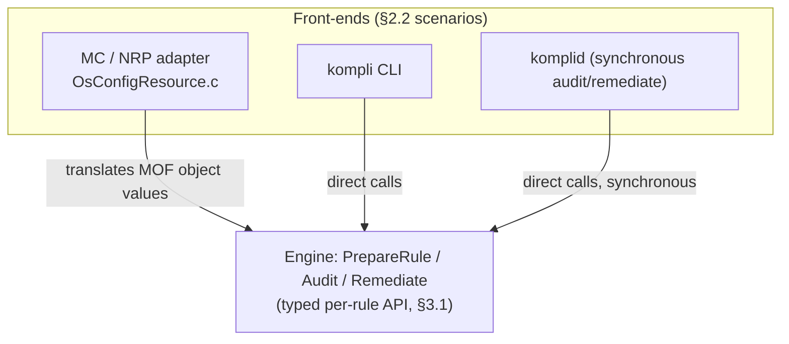
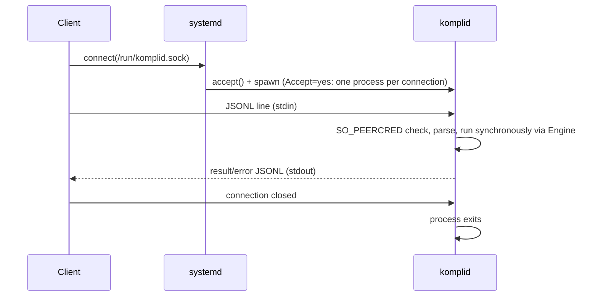
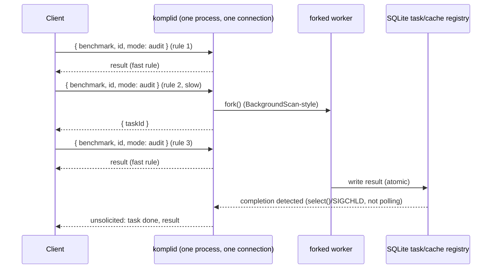
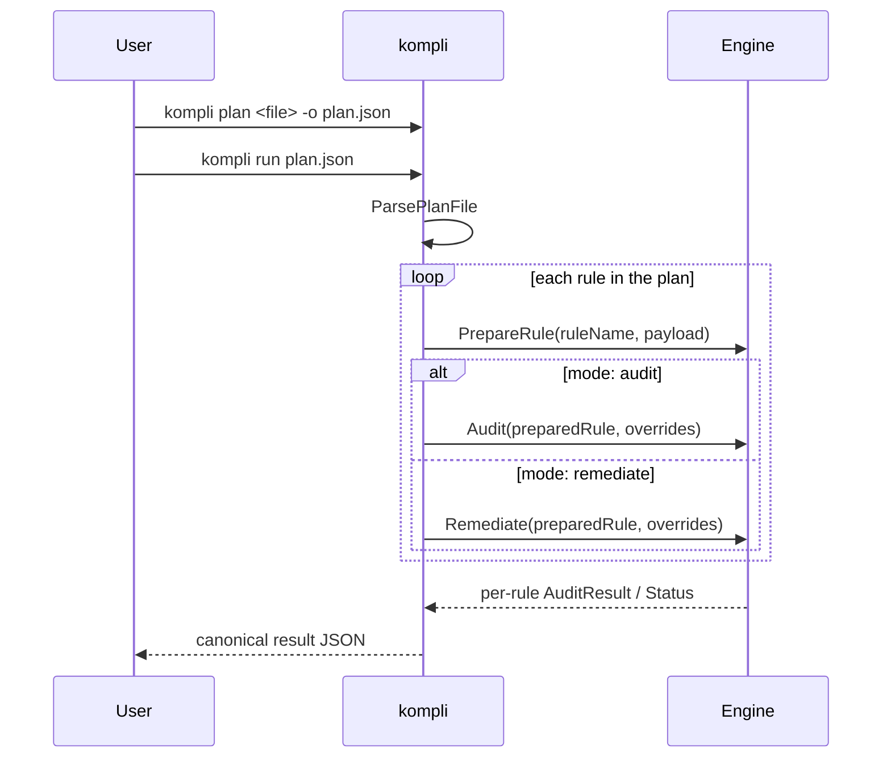
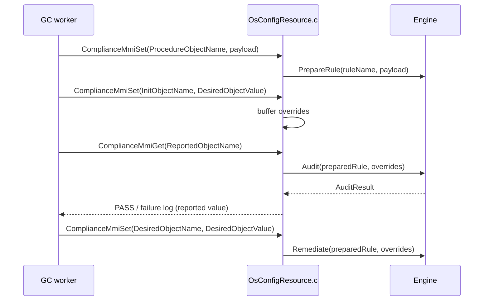

Kompli - North Star Architecture
========================================

# 1. Introduction

Kompli is a modular security configuration stack for Linux. Kompli supports management over Azure and Azure Portal and local CLI.

This document describes the North Star architecture of this project. Its prime target is to guide the people who develop kompli. The doc can be also useful to anyone who is interested to learn about this project.

Kompli design principles are the following:

- Policy evaluator engine.
- Modular architecture.
- Portable and extensible to other management platforms.
- Simple and focused on what is truly needed.
- Not permanently tied to any management authority.

The main way to extend kompli is by developing new [procedures](../src/modules/complianceengine/src/lib/procedures/).

# 2. Overall kompli Architecture

## 2.1. Repository Layout

```
src/
  adapters/
    mc/
      complianceengine/   NRP adapter (Baseline.c, OsConfigResource.c, generated MOF)
  common/
    commonutils/        Shared OS utility functions
    logging/             File, console, and syslog logging sinks
    parson/             Vendored JSON parser
    telemetry/          Telemetry support
  komplid/              kompli daemon: synchronous JSONL audit/remediate over UDS
  modules/
    complianceengine/   ComplianceEngine module and tests
      src/lib/          Core engine, evaluator, procedures, Lua integration
      src/so/           Module shared-object entry point
      src/benchmarkio/  Benchmark-definition parsing + input-file security
      src/kompli/       kompli CLI tool
      src/lua-evaluator/ Lua evaluator tool
      tests/            Unit tests
    mim/                ComplianceEngine MIM definition
    schema/             MIM validation schema
  tests/
    fuzzer/             ComplianceEngine libFuzzer target
```

## 2.2. Scenarios

Kompli supports two integration scenarios that share the same ComplianceEngine module:

- **Machine Configuration (NRP)** — a standalone shared library loaded by the GC worker on demand. The definitions generator produces MOF files that drive audit and remediation per rule.
- **CLI (`kompli`)** — a standalone CLI tool (`src/modules/complianceengine/src/cli/`) that reads a benchmark-definition JSON file (supplied on disk as a required positional filename argument; stdin is not supported for definitions) and directly executes audits or remediations without any platform or daemon involvement.

A third scenario, **`komplid`** (a native, systemd-managed daemon sharing the same ComplianceEngine core), runs a synchronous audit/remediate subset; see §3 and [src/komplid/README.md](../src/komplid/README.md) for its design.

All three scenarios ultimately drive the same `Engine` through the same
typed, stateless per-rule API (`PrepareRule`/`Audit`/`Remediate`, §3.1) — they
differ only in what sits in front of it (a GC-driven MOF file, a
benchmark-definition file, or a JSONL request). `kompli` CLI and `komplid`
call this API directly, in-process; the NRP/MC adapter translates the
MOF-driven `Procedure`/`Init`/`Reported`/`Desired` object values (§5.2) into
the same typed calls at its own boundary, so the MOF wire format stays
unchanged while nothing downstream of it speaks the legacy MMI protocol:



# 3. kompli Agent

Kompli will be able to run as a standalone daemon that can evaluate policy given requests from external sources.

> The concrete name for this daemon is **`komplid`**. Its build-graph location
> is [src/komplid/](../src/komplid/README.md), which runs a
> **synchronous** audit/remediate subset (`SO_PEERCRED`-authenticated,
> engine-backed) — see the linked README for the full design. It is started
> by systemd via socket activation with **`Accept=yes`** (one fresh process
> per connection, chosen for initial simplicity) and shares the
> ComplianceEngine core and the `benchmarkio`
> benchmark-definition/input-security library with the `kompli` CLI rather
> than duplicating that logic. Wire protocol: JSONL over the Unix domain
> socket, replacing the old MPI-over-UDS/HTTP design, one connection per
> session carrying many sequential per-rule requests (see
> [src/komplid/README.md](../src/komplid/README.md#wire-protocol) for the
> `requestId`/`benchmark`/`id`/`mode`/`parameters` request shape and
> `result`/`error` response envelopes). Slow rules respond with a task ID
> instead of blocking, backed by a SQLite task registry/audit-result cache
> (see
> [src/komplid/README.md](../src/komplid/README.md#long-running-rules-background-tasks)).
> `komplid` always
> runs as root; passthrough clients only need membership in
> a new `kompli` system group, with no fallback to standalone (root-required)
> execution if the daemon is unreachable (see
> [src/komplid/README.md](../src/komplid/README.md#privilege-model)).
> Neither `komplid` nor the `kompli` CLI
> use a shared persistent state directory (each `kompli`/`komplid`
> invocation gets its own ephemeral temp directory) — the `kompli` CLI stays
> ephemeral, while `komplid`'s own persistent state lives at the
> root-only `/var/lib/komplid/` (chosen to avoid clashing with
> GuestConfiguration's `/var/lib/GuestConfig`); see
> [docs/configuration.md](configuration.md).



The JSONL request/response schema is per-rule (see
[src/komplid/README.md](../src/komplid/README.md#wire-protocol) for the
full schema): one request per rule, many sequential requests per
connection. The background-task extension below lets a slow rule defer to a
task instead of blocking:



**Note on the Engine API**: `kompli`'s `Engine` class does not speak the
OSConfig-era MMI protocol (`MmiOpen`/`MmiSet`/`MmiGet`/`MmiClose` against an
opaque handle, with rule identity threaded through string `objectName`
prefixes). It exposes a typed, stateless per-rule API instead (§3.1):
preparing a rule's procedure payload produces an immutable value, and
auditing/remediating that rule takes it plus explicit parameter overrides as
arguments, with no mutable per-session rule database to carry stale state
between calls. `kompli` CLI and `komplid` call this API directly (§4.2); the
NRP/MC adapter (§5.1) translates the MOF wire format's legacy
`Procedure`/`Init`/`Reported`/`Desired` object values into the same calls at
its own boundary, so the MOF contract stays byte-identical to existing GC
consumers.

The old OSConfig platform daemon and its MPI/HTTP-over-UDS transport (formerly
documented here as "kompli Management Platform") has been removed from this
fork; `komplid`'s JSONL protocol is its replacement, not a peer to it. Its
remaining code footprint — [OsConfigResource.c](../src/adapters/mc/OsConfigResource.c)'s
calls into `mpiclient` (`CallMpiOpen`/`CallMpiSet`/`CallMpiGet`) for
non-Compliance (ASB-style) components — is retired alongside the rest of the
MMI protocol, since no platform daemon exists to answer those calls either.

## 3.1. Engine API

`kompli`'s `Engine` class (`src/modules/complianceengine/src/lib/Engine.{h,cpp}`)
exposes a typed, stateless per-rule API — no object-name strings, no opaque
session handles, and no mutable per-invocation rule database. It replaces the
inherited OSConfig MMI protocol (`MmiOpen`/`MmiSet`/`MmiGet`/`MmiClose`
against an `MMI_HANDLE`, with rule identity encoded into string `objectName`
prefixes such as `procedure{RuleName}`).

- **`PrepareRule(ruleName, procedurePayload)`** — parses a rule's audit and
  optional remediation procedure snippets plus its parameter defaults, and
  returns an immutable `PreparedRule` value. This has no side effect on the
  `Engine` itself — nothing is stored in a shared session map.
- **`Audit(preparedRule, overrides)`** — runs the audit procedure for the
  given prepared rule with the supplied parameter overrides, and returns a
  typed `AuditResult` (a structured status, not a string to parse for a
  `PASS` prefix).
- **`Remediate(preparedRule, overrides)`** — runs the remediation procedure
  for the given prepared rule with the supplied parameter overrides, and
  returns a typed `Status`.

Because each call takes the rule (and its overrides) explicitly as an
argument, there is no stale rule state to leak between invocations, and no
handle lifecycle (`MmiOpen`/`MmiClose`) to manage. `kompli` CLI and `komplid`
call this API in-process (§4.2); the NRP/MC adapter translates the MOF wire
format's `Procedure`/`Init`/`Reported`/`Desired` object values into the same
calls at its own boundary (§5.1, §5.3), so the MOF contract stays
byte-identical while nothing downstream of the adapter speaks the legacy MMI
protocol.

# 4. kompli Management Modules

## 4.1. ComplianceEngine Module

The ComplianceEngine module (`src/modules/complianceengine/`) evaluates security compliance rules using recursive JSON payloads with logical combinators (`allOf`, `anyOf`, `not`), built-in C++ procedures, and Lua scripts. It is implemented as a dynamically linked shared object (`.so`) and exposes a single MIM component: `Compliance`.

The MIM definition is at `src/modules/schema/mim.schema.json`. The four verbs
below map directly onto the `Engine` API (§3.1); on the NRP path they arrive
as the MOF-encoded `Procedure`/`Init`/`Reported`/`Desired` object values
(§5.2), translated by the adapter (§5.1) into the same calls that `kompli`
CLI and `komplid` make directly.

### Procedure entries (`procedure{RuleName}`)

Maps to `Engine::PrepareRule`. The value is a base64-encoded JSON object containing audit and optional remediation procedure snippets, plus a `parameters` map of supported parameters and their default values. The engine decodes the payload and returns an immutable `PreparedRule` carrying the procedure definition and default parameter values for the rule.

### Init entries (`init{RuleName}`)

Supplies the parameter overrides passed to `Engine::Audit` alongside the `PreparedRule`. The value is a human-readable, space-separated key-value string (e.g. `PKG_NAME=cron`) used to override the parameters registered by the matching procedure entry.

### Remediate entries (`remediate{RuleName}`)

Maps to `Engine::Remediate`. Same key-value format as init entries, passed to `Remediate` as the parameter overrides. Triggers execution of the remediation procedure for the rule with the supplied parameter values.

### Audit entries (`audit{RuleName}`)

Maps to `Engine::Audit`. Triggers execution of the audit procedure and returns a typed `AuditResult`; the NRP adapter renders it as a string beginning with `PASS` on success or a descriptive log on failure to preserve the existing MOF-reported-value contract.

## 4.2. kompli CLI Mode

`kompli` (`src/modules/complianceengine/src/cli/`) is a standalone CLI tool that reads a benchmark-definition JSON file and drives the engine directly — no platform daemon, MPI, or RC/DC files are involved. Benchmark-definition parsing and the root-safe input-file checks live in the sibling `src/modules/complianceengine/src/benchmarkio/` library so `komplid` can reuse them later without depending on CLI-only presentation code.

See [cli.md](cli.md) for the target design contract (subcommands, flags, the `plan`/`run` per-rule model, plan file format) — this section only summarizes the CLI's shape.

### Commands

`kompli` has four subcommands:

| Command | Description |
|---|---|
| `render [file]` | Render a canonical result JSON (from `plan`+`run`) into a presentation format. |
| `plan <file>...` | Generate a plan file selecting a mode (audit/remediate/enforce) per rule, from one or more definition files. |
| `run <plan-file>` | Execute a plan file (one or more benchmark files), emit one combined canonical result JSON. |
| `list <file>` | List every rule's `id`/`title`, one per line. |

See [cli.md §2](cli.md#2-plan--run-per-rule-granularity) for `plan`/`run`'s full contract (plan file format, per-rule mode selection, multi-benchmark plans). There is no whole-file, single-mode `audit`/`remediate` command — `plan`+`run` is the only way to scope and execute rules.

### Input

`plan` / `run` / `list` require a file as a positional filename argument (the benchmark-definition file for `plan`/`list`, the plan file for `run`); a missing path or `-` is a hard error — stdin is deliberately unsupported for definitions so the file-integrity checks (root-owned non-writable parent directory, `O_NOFOLLOW` open, regular-file/ownership/mode checks) can never be bypassed by piping data into the root process. `render` is a root-free, pure transformation and does accept stdin.

### Per-rule execution

`kompli run` executes a plan file produced by `kompli plan` (see [cli.md §2](cli.md#2-plan--run-per-rule-granularity)): for each rule listed in the plan, in the mode the plan assigns it (`audit`/`remediate`/the reserved `enforce`), `kompli`:

1. **Prepares the rule** — calls `engine.PrepareRule(ruleName, procedurePayload)` to load the audit/remediation definition and its default parameter values, getting back a `PreparedRule`.
2. **Audit mode** — calls `engine.Audit(preparedRule, overrides)`, passing any parameter overrides directly, to execute the audit and collect the result.
3. **Remediate mode** — calls `engine.Remediate(preparedRule, overrides)` to execute the remediation procedure with the supplied parameter values.



### Output formats

`render` writes to stdout in the format selected by `--format` (default `junit`):

| Format | Description |
|---|---|
| `junit` (default) | JUnit XML, one `<testcase>` per rule |
| `nested-list` | Human-readable hierarchical text |
| `compact-list` | Single-line-per-rule text |
| `debug` | Verbose diagnostic output |

`run` always emits the canonical result JSON; `render` is what turns that JSON into one of the formats above.

### Security controls

- The process umask is tightened to at least `S_IRWXG | S_IRWXO` at startup (preserving any stricter inherited mask), restricting file-creation permissions.
- The positional benchmark-definition filename is checked for path traversal and a writable parent directory, then opened with `O_NOFOLLOW`, before it is read.
- kompli logs to stderr unconditionally; there is no `--log-file` flag (removed — see [logging.md](logging.md) for the sink model and why the operator-supplied log path was eliminated rather than hardened).

### Definition versioning & compatibility

A benchmark-definition file carries **three independent version axes**, each
answering a different question and consumed by a different layer:

| Field | Axis | Consumer | Comparison |
|---|---|---|---|
| `apiVersion` | file **format** (envelope shape) | the parser | exact / allowlist |
| `version` (semver) | **content** revision for a fixed format + identity | `plan`/`run` | semver **range** |
| `benchmarkVersion` | **upstream** CIS/STIG version | identity tuple | exact (identity) |

- **`apiVersion` — format gate.** The parser validates `apiVersion` against a
  supported set and **rejects** an unknown format rather than parsing it
  best-effort. A JSON-schema change that reshapes the on-disk format bumps
  `apiVersion`. kompli may accept a
  **bounded window** of `apiVersion`s so a definitions package can lag the
  installed kompli during an upgrade.
- **`version` — content semver, what plans pin.** A plan records each
  benchmark's `version` plus a `versionConstraint` (default **caret** `^`,
  "same major"). At `run`, kompli resolves the on-disk definition's `version`:
  if it satisfies the constraint (a patch/minor update — e.g. an
  admin-applied security fix), the run proceeds **transparently**; if not (a
  **major** bump), the run **hard-errors** and asks the user to review and
  regenerate the plan. This is what lets `/etc/kompli/definitions/` be auto-updated without invalidating every
  pinned plan on each bugfix.
- **`benchmarkVersion` — upstream identity.** Part of the identity tuple
  `(framework, distribution, distributionVersion, benchmarkVersion)`; a change
  here is a **different benchmark** (re-plan by design — already a cross-version
  hard error), not a compatible update.

**Bump semantics.** MAJOR = a change that could invalidate or silently alter a
plan-referenced rule (rule `id` removed/renamed, parameter removed/renamed or
`validationRegex` tightened, a rule's semantics redefined); MINOR = additive
(new rule, new optional parameter); PATCH = a behavior-preserving payload fix.
The definitions generator enforces the mechanically-detectable **floor** and the
author **declares** the ceiling (a payload change is ≥ PATCH, justified in
review), since a bugfix and a semantic redefinition both read as "the payload
changed".

# 5. kompli Universal Native Resource Provider (NRP)

The kompli Universal Native Resource Provider (NRP) Adapter links kompli to the [Azure Automanage Machine Configuration (MC)](https://learn.microsoft.com/en-us/azure/governance/machine-configuration/).

Using MC and the kompli Universal NRP, we can create Azure Policies that automatically target for compliance audit or remediation all Linux devices in a particular Azure subscription and Azure resource group.

## 5.1. Compliance NRP Adapter

The NRP scenario uses a standalone shared library (`src/adapters/mc/complianceengine/`) bundled in a policy package. The GC worker dynamically loads the library periodically and uses the `OsConfigResource` class as its interface.

The adapter implements `ComplianceMmiSet` and `ComplianceMmiGet` functions, which follow the same C interface as the existing `AsbMmiSet`/`AsbMmiGet` functions — this is the GC-facing contract, and it stays unchanged. `OsConfigResource.c` selects the appropriate function set at library-load time based on `ComponentName`, so both ASB and Compliance rules can coexist in the same package without changes to the GC worker. Internally, the Compliance function set translates each call's MOF-encoded object name and value into the typed `Engine` API (§3.1, §5.3) rather than passing the object name through to a generic per-rule protocol.

Direct in-process calls are used (no MPI communication) to match the existing ASB implementation and avoid introducing additional IPC complexity for this critical path.

## 5.2. MOF File Structure

The definitions generator emits one MOF resource instance per compliance rule:

```
instance of OsConfigResource as $OsConfigResource0ref {
    ResourceID           = "Ensure X Y Z";          // human-readable rule title
    ComponentName        = "Compliance";
    ProcedureObjectName  = "procedure{RuleName}";   // optional
    ProcedureObjectValue = "{base64}";              // optional
    InitObjectName       = "init{RuleName}";
    ReportedObjectName   = "audit{RuleName}";
    ExpectedObjectValue  = "PASS";
    DesiredObjectName    = "remediate{RuleName}";
    DesiredObjectValue   = "{key-value string}";    // e.g. "PKG_NAME=cron"
    ModuleName           = "GuestConfiguration";
    ModuleVersion        = "1.0.0";
    ConfigurationName    = "Compliance";
};
```

`ProcedureObjectName` and `ProcedureObjectValue` are optional. When absent they are ignored, leaving existing ASB resource instances unaffected. The Compliance module validates whether these fields are present and whether the payload is correctly formatted.

## 5.3. NRP Control Flow

For each MOF resource instance the GC worker drives the following sequence.
The MOF fields (§5.2) are unchanged, so the GC worker still issues four
separate calls; the adapter buffers the parameter overrides from the Init
call and passes them to `Engine::Audit` together with the subsequent Audit
call, collapsing the two into a single typed call:

1. **Procedure setup** — `ComplianceMmiSet(ProcedureObjectName, ProcedureObjectValue)` calls `Engine::PrepareRule` to register the audit/remediation procedures and their default parameter values.
2. **Init (audit parameters)** — `ComplianceMmiSet(InitObjectName, DesiredObjectValue)` buffers the user-provided parameter overrides at the adapter, to be used by the next step.
3. **Audit** — `ComplianceMmiGet(ReportedObjectName)` calls `Engine::Audit` with the buffered overrides, and returns the result (`PASS` or a descriptive failure log).
4. **Remediation** — `ComplianceMmiSet(DesiredObjectName, DesiredObjectValue)` calls `Engine::Remediate` with the user-provided parameter values.


