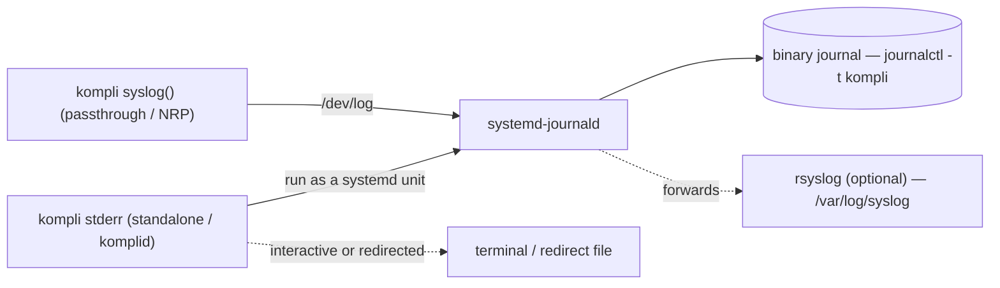

# kompli — Logging

Design decision and reference for where kompli's diagnostic logging goes, and why.

`komplid`'s wire-protocol request/response handling is separate from this
shared logging library (see [../src/komplid/README.md](../src/komplid/README.md));
its Engine-internal `OsConfigLog*` calls go through the same sinks described
here.

## Model

kompli runs in several scenarios. The log **sink** is chosen by one question: does
kompli own a process with a clean stderr of its own, or is it running under the
configuration agent? **No log file is opened by path in any of them.**

| Scenario | What it is | Sink |
|----------|-----------|------|
| **Standalone** | an operator runs the `kompli` CLI (`plan`/`run`/`render`/`list`) directly | **stderr** |
| **komplid** (daemon) | the systemd socket-activated service (`src/komplid/`) | **stderr** — its unit routes stderr to the journal |
| **Passthrough** | the configuration agent invokes the `kompli` binary on demand (a request “passed through” to a fresh invocation) | **system log** via `syslog(3)` |
| **NRP** (Machine Configuration) | the `.so` adapter (`OsConfigResource.c` / `ComplianceEngineModule.c`) loaded **in-process** by the GC worker | **system log** via `syslog(3)` |

**Governing rule:** log to **stderr** when kompli owns the process (standalone CLI,
komplid) and to **`syslog(3)`** when it runs under the agent (passthrough, and the
in-process NRP), where its own stderr is not an independent channel.

The canonical result JSON is the CLI's **stdout** payload; diagnostics must never
share that stream — hence stderr or syslog, never stdout.

## Background — why this changed

- The shared logging macro historically wrote console output with `printf`, i.e. to
  **stdout**. A `kompli run` with no `--log-file` therefore interleaved `[INFO]…`
  lines into the result JSON.
- `--log-file` was originally added **only** to escape that stdout clobbering — a
  workaround, not a feature in its own right.
- **Fix:** the console macro writes to **stderr**
  (`__LOG__` → `fprintf(stderr, …)` in `src/common/logging/Logging.h`). stdout is
  clean, which removes the original reason `--log-file` existed.

## How the logs reach the system log (mechanics)

Two *different* mechanisms are in play, and journald can ingest both — this is why
different scenarios pick different sinks.

- **stderr** is just a file descriptor (fd 2). kompli writes bytes to it; *where they
  land* is decided by whoever launched the process — a terminal, a redirect
  (`kompli run plan.json 2> run.log`), or, for a **systemd service**, the journal
  (systemd sets `StandardError=journal` by default). kompli doesn't “connect” to
  anything; it emits and lets the environment route.
- **`syslog(3)`** is an explicit IPC call: `openlog()` + `syslog(priority, …)` sends a
  structured datagram to the `/dev/log` socket the system log daemon listens on. It
  reaches the system log the same way regardless of how the process was started —
  which is exactly why agent-driven / in-process code uses it.

On a systemd host the daemon is **systemd-journald**. It listens on both inputs and
stores everything in a **binary journal** (`/var/log/journal/` when persistent, else
`/run/log/journal/`) that it rotates and size-caps itself (`journald.conf`) — read
with `journalctl` (e.g. `journalctl -t kompli`). If `rsyslog`/`syslog-ng` is also
installed, journald forwards to it and the classic plaintext files
(`/var/log/syslog`, `/var/log/messages`) appear as well.

So **kompli opens and manages no plaintext logfile in any scenario**:

- standalone / komplid emit to **stderr** — the terminal, a redirect, or (running as
  a unit) the journal owns it;
- passthrough / NRP call **`syslog()`** — **journald** (systemd) owns the storage,
  rotation, and retention. There is no file we `tail`; you query the journal.

**Why not stderr everywhere?** The **NRP** adapter is a shared library loaded *inside
the agent's process*, so its stderr **is the agent's** — a channel kompli neither
owns nor can rely on (it may be discarded or interleaved with the agent's own
output). `syslog()` is self-contained: it always reaches the system log, tagged with
kompli's own ident, independent of the host process. The same reasoning applies to
passthrough, where kompli is launched by the agent rather than an interactive shell.

## Decisions

1. **Console logging → stderr.** Diagnostics never touch stdout.
2. **Standalone default → stderr.** No file by default;
   operators redirect (`kompli run plan.json 2> run.log`) for persistence.
   `komplid` logs to stderr **unconditionally**; there is no `IsDaemon()`
   (`getppid()==1`) heuristic gating `IsConsoleLoggingEnabled()` — such a
   heuristic wouldn't cover ad-hoc local runs, and would falsely suppress
   console logging for the standalone CLI in some containerized CI
   environments where kompli runs as a direct child of PID 1.
3. **Passthrough and NRP → `syslog(3)`.** Both run under the configuration
   agent, so they route to the system log via `syslog()` rather than
   opening a file — the in-process NRP modules can't rely on their own
   stderr (see the mechanics section). This replaces both NRP adapters'
   (`ComplianceEngineModule.c` and `OsConfigResource.c`) previous fixed-path
   `OpenLog()` open. Open with `openlog("kompli", LOG_PID, LOG_DAEMON)` so
   records filter cleanly (`journalctl -t kompli`).
4. **`--log-file` removed.** Its sole purpose was already served by
   stderr redirection. Keeping it would have re-introduced an operator-supplied,
   root-opened path — the *only* attacker-influenceable log path in the system.
5. **No app-managed log-file rotation for kompli** — there is no
   kompli-managed log file to rotate. Retention/rotation is
   owned by syslog/journald (passthrough/NRP) or the operator (standalone/komplid).

## Security outcome — the residual TOCTOU closed by *elimination*

The former residual TOCTOU (previously documented in
`src/modules/complianceengine/src/kompli/THREAT_MODEL.md`): `OpenLog()` is path-only
and `TrimLog()` re-opens the path on every rotation, leaving a check-to-use window
on the operator-supplied `--log-file`. The mitigation to date (require a
root-owned, non-writable parent) only *narrowed* it — removing the flag
closed it outright.

**Resolution: remove the operator-supplied path entirely.** With standalone/komplid
→ stderr and passthrough/NRP → syslog, kompli never opens an attacker-influenceable
log path, so there is no window to close. Removing the risky input is strictly
stronger than hardening it.

Consequently, the previously-scoped **descriptor-based `OpenLog` rework** (an
`OpenLogEx`/verified-fd open with `O_NOFOLLOW` + `fstat`, dir-fd `renameat` rotation)
and the CLI's `RefuseUnsafeLogFile` are **no longer needed** and are dropped from the
roadmap. The only remaining `OpenLog(path)` consumers are fixed, root-owned paths
(e.g. telemetry's own file), which are low-risk `Default`-mode opens.

## Level mapping (OsConfig → syslog)

| OsConfig level | syslog priority |
|----------------|-----------------|
| Emergency | `LOG_EMERG` |
| Alert | `LOG_ALERT` |
| Critical | `LOG_CRIT` |
| Error | `LOG_ERR` |
| Warning | `LOG_WARNING` |
| Notice | `LOG_NOTICE` |
| Informational | `LOG_INFO` |
| Debug | `LOG_DEBUG` |

## Design notes

- **Syslog sink in the shared logging library** (`Logging.c`/`Logging.h`): a third
  mode alongside file/console. When active, `OsConfigLog(...)` routes to
  `syslog(priority, "%s", …)` instead of a `FILE*`, using the mapping above. The file
  mode stays for other consumers (telemetry) — `OpenSyslog`/`CloseSyslog`/
  `IsSyslogLoggingEnabled` plus `LoggingLevelToSyslogPriority`.
- **NRP module init** (`src/modules/complianceengine/src/so/ComplianceEngineModule.c`
  and `src/adapters/mc/OsConfigResource.c`) switches from
  `OpenLog("/var/log/osconfig_nrp.log", …)` to the syslog sink: both
  call `OpenSyslog("kompli")`/`CloseSyslog()` (`InitModule`/`DestroyModule`
  for the former; `Initialize`/`Destroy` for the latter, whose `GetLog()`
  always returns `NULL` since the syslog path never touches the handle).
- **`Main.cpp`** has no `--log-file` (and no `RefuseUnsafeLogFile` call/validation);
  the stderr default comes from the console→stderr fix.
- The `OpenLogEx`/hardened-open design and the `logrotate.d/kompli` idea are
  retired — both obviated by this model.

## Caveats / migration

- **Rate-limiting.** journald/syslog rate-limits; a debug flood can drop lines.
  Acceptable for audit/remediation records; note it if complete debug traces are ever
  required.
- **Operator migration.** Anything tailing `/var/log/osconfig_nrp.log` moves to
  `journalctl -t kompli` (or the configured syslog target). Call this out in the
  package changelog.
- **Telemetry** keeps its own file log; it is out of scope for this change.
- **Open question: definitions-generator test-reporting regression.**
  The definitions generator's `tests/reporting/osconfig_logfile.py`'s
  `load_osconfig_logfile` regex-parses the old
  `[timestamp][LEVEL][file:line] [OsConfigResource] …` prefix out of
  `/var/log/osconfig_nrp.log` to compute per-rule `duration_seconds` for the
  JUnit report (`reporting/junit.py`). **Resolved (2026-09-15):** reworked
  against `journalctl -t kompli` instead — `run_osconfig.sh` now brackets the
  NRP run with a journal cursor (`journalctl -n0 --show-cursor` before,
  `--after-cursor` after) and stores `journalctl -t kompli --after-cursor=…
  -o json` (JSONL, one object per entry with a precise
  `__REALTIME_TIMESTAMP`) as the artifact
  `log/osconfig_nrp_journal.jsonl`, replacing the old
  `/var/log/osconfig_nrp.log` copy. `osconfig_logfile.py` parses that JSONL
  instead of the old prefixed-text format — the `MESSAGE` field still carries
  the same `[OsConfigResource...]` literal text (only the
  `[timestamp][LEVEL][file:line]` wrapper, added solely by the file/console
  sinks, is gone), so the same sequential-diff algorithm (first `Load` marks
  the start, each subsequent `Test` line's timestamp diffed against the
  previous one) carries over unchanged. Cursor-bracketing (rather than
  `--since`/`--until` wall-clock bounds) avoids the concurrent-run
  correlation problem raised below. Stays sudo-free on a bare developer
  machine: `journalctl` only runs inside `run_osconfig.sh`, which already
  requires root unconditionally for unrelated reasons (OMI/GC agent
  install), and only its already-extracted JSONL artifact is read downstream
  by `osconfig_logfile.py`/`accumulate.py` — those never invoke `journalctl`
  themselves.

## Supersedes

- The "descriptor-based rework" **roadmap item** in `src/komplid/README.md` (§ Logging)
  — replaced by *eliminate the operator path*.
- The "Residual TOCTOU" note in
  `src/modules/complianceengine/src/kompli/THREAT_MODEL.md` — resolved by removal; that
  note (and the `--log-file` mentions in `docs/cli.md`) are updated to match.
